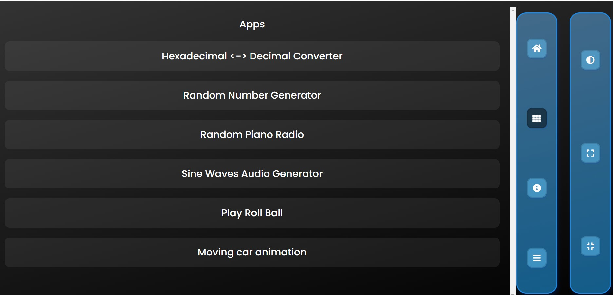
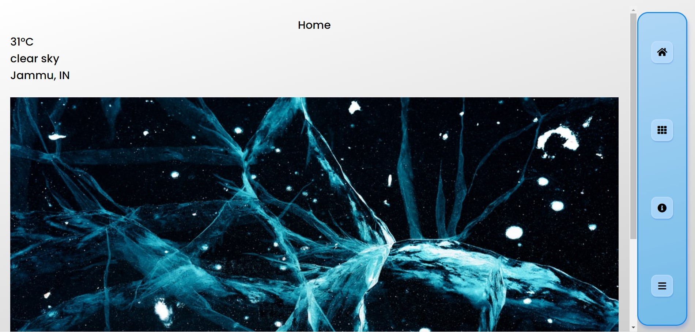
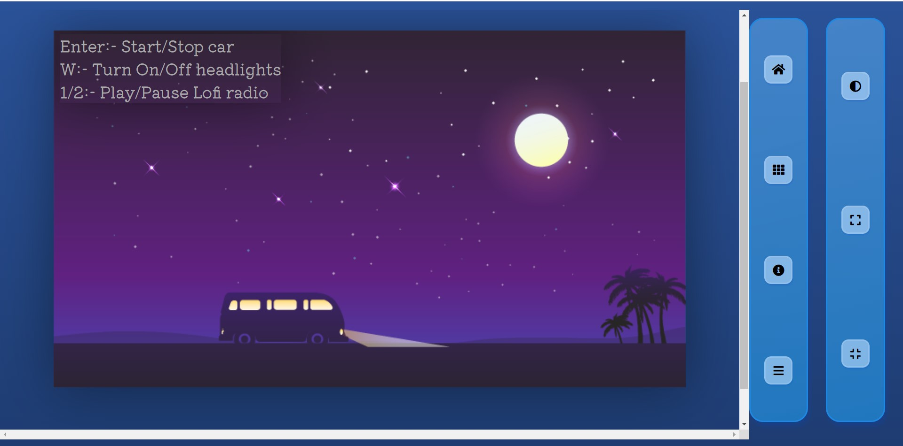
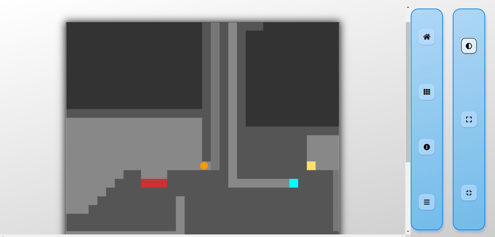
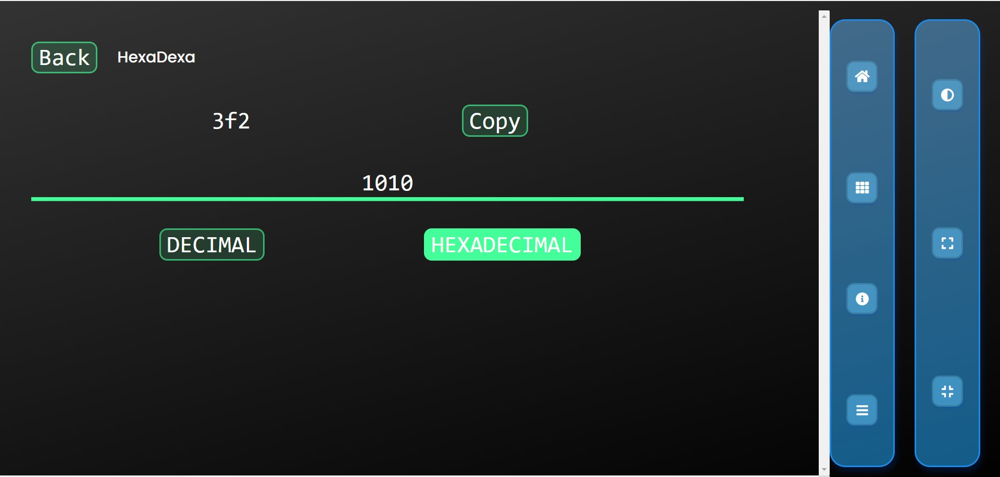
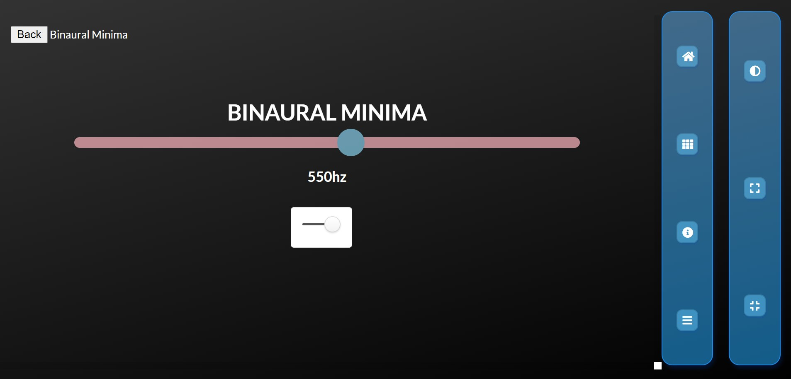

 

 

<h1 align="center" ><a href="https://n-ce.github.io/Bromage/"> BROMAGE </a></h1>

    <h3 align="center">A homepage (with widgets) for browsers!</h3>

<h2 align="center">Website at a glance</h2>

   
 
                                                

# A Browser Homepage - Bromage

- A homepage for browsers! with core functionalities of an app created without NodeJS to avoid overhead, just using pure HTML5, CSS3 and ES6 to maximize page efficiency.

- Also consists a library of small code HTML apps and games just like a traditional homescreen.

- It's Modular structure is based on Fetch API, which dynamically loads HTML Apps from [ Modules Folder.](https://github.com/n-ce/SPACE/blob/main/Modules)

- [Learn more about the Modules.](https://github.com/n-ce/SPACE/blob/main/Modules/Modules.md)
